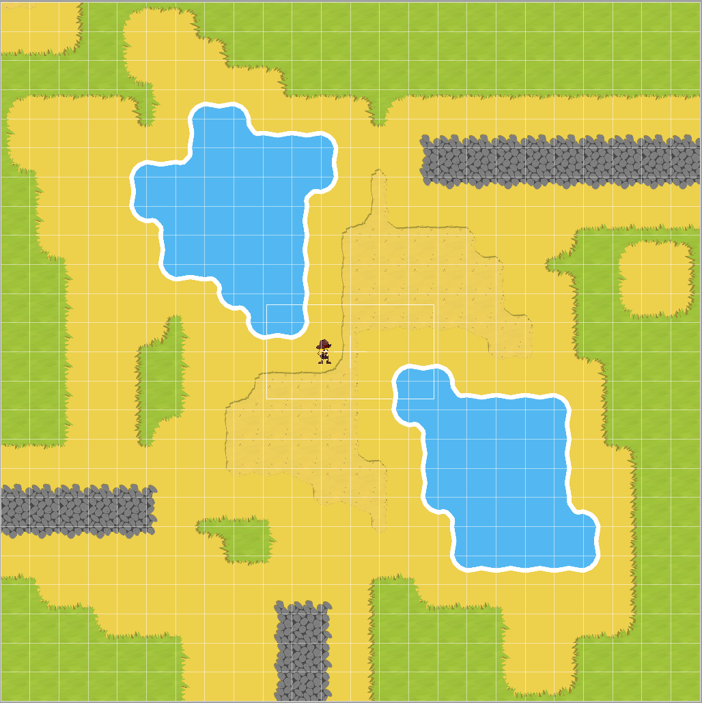

How-to Play With Components

Create a new Project with template

New > Project > iOS Game 
Product name: “GameTechBrisbane1”
Devices: iPhone
Language: Swift
Game technology: SpriteKit
Integrate GameplayKit 

Change it to be landscape only, and iPhone only.

From the template project add:
* Components
* GKSupport
* SKTUtils
Using the Finder, and then choose Project > Add files… 

Expand the zipped graphics files from into seperate folders: 
http://www.gameart2d.com/the-zombies-free-sprites.html
http://www.gameart2d.com/adventurer-girl---free-sprites.html

Rename them using the Mac rename command (right-click a multiple selection in Finder) so that they have no parentheses or spaces, and also are distinct - eg prefix with “Hero” and “FemaleZombie” / “MaleZombie”.

Use the helper scripts `scaleToWidth` and `icons.sh` from my github
* [scaleToWidth](https://gist.github.com/sarah-j-smith/25a54689ffbbdbcce8ab)
* [icons.sh](https://gist.github.com/sarah-j-smith/bfcbe7d04f58d72c33d7ff1f436f46d2)

Run `icons.sh` on the file HeroIdle1.png to create a set of icons.

Add the Icons into the AppIcon slots in the `Assets.xcassets` folder.

Make a Launchscreen storyboard with a logo and background.

Now lets work on GameScene.sks - delete the existing label from it.

Set Size in the inspector top-right to iPhone 6s Plus - Landscape, and change the background color to grey.

Drag a HeroIdle1 figure into the middle of the files list, next to GameScene.swift.

File > New > Sprite Kit Tile Set > Grid Tile Set
“GardenTileSet”

Click the root node of the tile set “Sample Tile Set” and rename it to “GardenTileSet”

Drag a Tile Map into the GameScene and choose “GardenTileSet” as the tiles.  Leave the dimensions as is - it will be 3072 x 3072 points in size.  Changes its name to “Background”

Drag in a Color Sprite node and set it to this size.  Put it behind the tile map.  Changes its name to “BaseLayer”

Right-click and edit the tile map, and fill it with grass.  Make some areas of sand and water, some other features with the stone.  Change the color of the BaseLayer to match the Background so that it doesn’t have holes in it.

The result should like this.

Compile and run - check it works.

Now import all the artwork.  To do this, first drag in an instance of the artwork, eg the ZombieIdle1.png into the project and then into the scene.  Drag the handles while pressing “shift” and get the size correct.  Take a note of the width - it will be eg 120 points.

Now use the `scaleToWidth` script to create 1x, 2x and 3x artwork for each sprite at the correct width:
* HeroIdle, HeroRun, HeroMelee and HeroDead
* FemaleZombieWalk, FemaleZombieIdle, FemaleZombieDead, FemaleZombieAttack
* MaleZombieWalk, MaleZombieIdle, MaleZombieDead, MaleZombieAttack

Create a new File > Assets Catalog > “GameArt.xcassets”.  
Create a “Sprite Atlas” for each character in the GameArt catalog.  Place the sprites into it.

Let’s get our hero moving around.

Click the hero character in the scene and on the inspector window at the far-right column add a “PlayerCharacter” component.  This sets up physics and also binds and agent to the sprite so it can take part in GameplayKit’s pathfinding and goal AI.

Now add a “MoveWithTouch” component.  Set the mobSpeed to say 280.

Run the project - you should be able to tap the screen and have the player move around.  Trouble is she just skates - she doesn’t animate.

Create a new File > SKAction and add a “HeroIdle” entry by clicking the + sign button at the bottom left.  Drag in to that entry an Animate with Textures action then fill it with the HeroIdleN sprites from the media browser.  Repeat for the other hero textures.

Make each one repeat infinitely by clicking the infinity symbol bottom left of the action until it fills the time line.  Do this for each except “HeroDie” - for that add a FadeOut after the single animation.

Click the hero and add a MobState component.  This one detects how the hero is moving and sets the appropriate animation based on the hero’s current state.  Fill out the fields with the correct names.

Run the game and our hero should now run around the field.